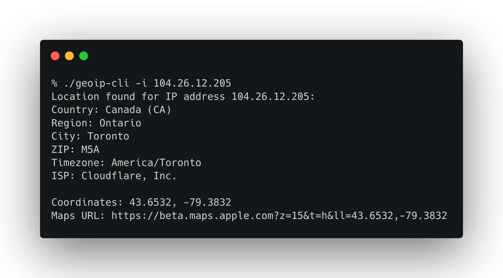

# geoip-cli

A simple command line utility to get the geolocation of an IP address written in the Crystal programming language.



### Prerequisites

Requires Crystal version 1.15 or higher installed on your system.

### Running the program

````bash
crystal run src/geoip-cli.cr -- [arguments] 
````

### Compiling

You can compile the program using directly the Crystal compiler, like this:

````bash
crystal build --release --no-debug -o ./bin/geoip-cli ./src/geoip-cli.cr
````

Alternatively, you can compile the program using make:

````bash
make
# If you want to make the command available system-wide, you can then run:
make install
````

Compiled binary will be available in the bin directory.

### Usage

````bash
./geoip-cli [arguments]
    -i IP, --ip=IP                   Some IP address to fetch info for.
    -v, --version                    Show version
    -h, --help                       Show help
````
